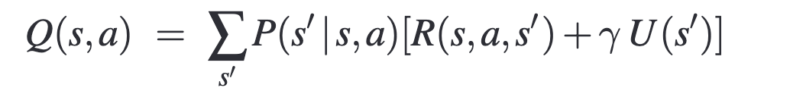

# MDP - Value Iteration
## Implementation of value iteration MDP.
<!--  -->

### Algorithm


### Q-Value function


The `main.py` file implements the above algorithm and the `q_value` function.

## Run
Execute the following command.
```sh
python main.py
```

